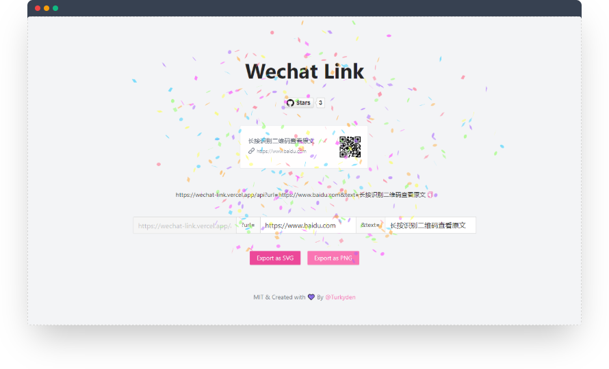

<h1 align="center">Wechat Link</h1>

<p align="center">🥕 微信公众号无法外链怎么办？一行代码搞定长按识别二维码。</p>

<p align="center">
  <a href="https://www.baidu.com" target="_blank"></a>
</p>

## Usage

Write with markdown:

```markdown
[](https://www.baidu.com)
```

Preview:

[](https://www.baidu.com)

## How does it work ?


## API

| Params | Description | Default | Required |
| --- | ------ | ----- | --- |
| url | The outer url links of wechat | https://www.baidu.com | true |
| text | The text content displayed in card | 长按识别二维码查看原文 | false |

## Getting Started

Install dependencies,

```bash
$ yarn
```

Start the dev server,

```bash
$ yarn start
```

## Contributors

Thanks goes to these people:


Please Feel free to enjoy and participate in open source!

## Stargazers

Thanks for your star!

[](https://github.com/Turkyden/wechat-link/stargazers)

[](https://vercel.com/new/git/external?repository-url=https%3A%2F%2Fgithub.com%2FTurkyden%2Fwechat-link)

## License

[MIT](./LICENSE)
